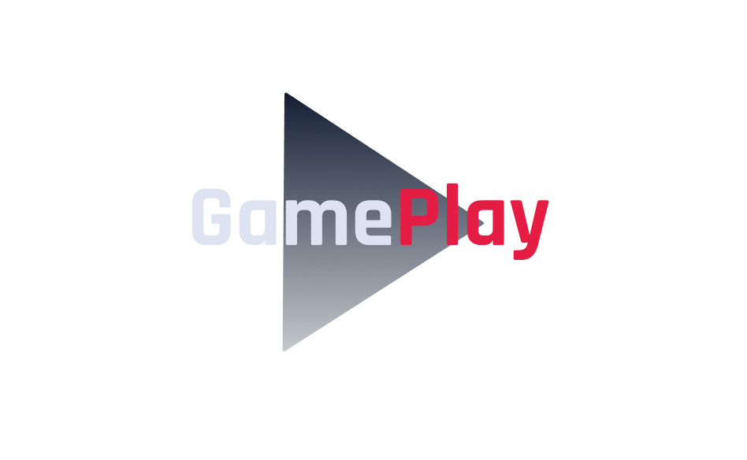

  

<h4 align="center">
  <strong>Conecte-se e organize suas jogatinas.</strong>
</h4>

---

<h3 align="center">
    Trilha React Native 
</h3>

        
        
        
         
        

## 🎮 Projeto: Gameplay

Aplicativo para lhe ajudar a conectar-se e organiza o momento de diversão e jogar com os amigos. Crie grupos para jogar seus games favoritos com seus amigos com esse App que possui autenticação com Discord.

## 🚀 Tecnologias

Este projeto foi construído utilizando:

- [ ] React Native
- [ ] Typescript
- [ ] Expo
- [ ] Context API
- [ ] Async Storage
- [ ] Vector Icons
- [ ] React Native Svg e Svg Transform
- [ ] Axios
- [ ] Gradient colors
- [ ] OAuth2 Discord
- [ ] Expo Google Fonts
- [ ] React Navigation Stack
- [ ] React Native Gesture Handler
- [ ] Expo Authentication
- [ ] React Native Share
- [ ] Deep Link

## 💫 Features

- ✅ Autenticação Social OAuth2 com servidor do Discord.
- ✅ Obtém perfil do usuário cadastro no Discord (username e avatar);
- ✅ Lista os servidores do Discord que o usuário faz parte;
- ✅ Permite realizar o agendamento de partidas;
- ✅ Permite filtrar as partidas por categoria;
- ✅ Exibe se a partida foi agendada em um servidor próprio (anfitrião) ou em servidores de outros (convidado);
- ✅ Compartilha o convite para ingressar no servidor do usuário;
- ✅ Permite redirecionar o usuário para o seu próprio servidor;
- ✅ Disponibiliza a função de Logout.

## 🚴‍♂️ Rodando Projeto

- Instale as dependências do projeto `yarn`

- Inicie o Expo Metro Bundler rodando `expo start` ou `yarn start`

## 🔖 Layout

Você pode visualizar o layout do projeto através [desse link](https://www.figma.com/file/0kv33XYjvOgvKGKHBaiR07/GamePlay-NLW-Together?node-id=58913%3A83). É necessário ter conta no [Figma](http://figma.com/) para acessá-lo.

## 📢 Contribuição

Está aplicação foi construida no evento NLW#6 da Rocketseat, que disponibilizou video aulas do projeto **Gameplay**.

Feito com 💜 by Rocketseat :wave: [Participe da nossa comunidade!](https://discord.gg/YxU7fJT)

---

Feito com 💜 por [Andre Sampaio](https://github.com/apsampaio) 
