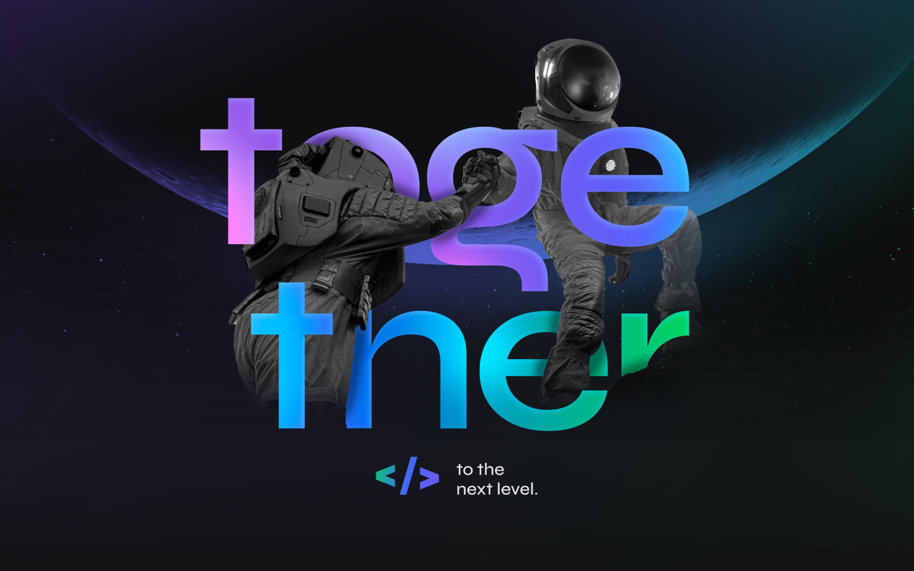

<h3 align="center">
    Trilha NodeJS 
</h3>

        
        
        
                
        

## 🚀 Tecnologias

Este projeto foi construído utilizando:

- [NodeJS](https://nodejs.org/en/)
- [Express](https://expressjs.com/pt-br/)
- [Typescript](https://www.typescriptlang.org/)
- [SQLite](https://www.sqlite.org/index.html)
- [TypeORM](https://typeorm.io/#/)

## 🏃‍♂ Rodando Projeto

## 📢 Contribuição

Está aplicação foi construida no evento NLW#6 da Rocketseat, que disponibilizou video aulas do projeto **Valoriza**.

Feito com 💜 by Rocketseat :wave: [Participe da nossa comunidade!](https://discord.gg/YxU7fJT)

---

Feito com 💜 por [Andre Sampaio](https://github.com/apsampaio) 
